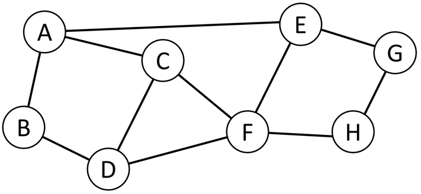

</style>
        <link rel="stylesheet" href="https://cdn.jsdelivr.net/npm/katex/dist/katex.min.css">
<link href="https://cdn.jsdelivr.net/npm/katex-copytex@latest/dist/katex-copytex.min.css" rel="stylesheet" type="text/css">
        <link rel="stylesheet" href="https://cdn.jsdelivr.net/gh/Microsoft/vscode/extensions/markdown-language-features/media/markdown.css">
<link rel="stylesheet" href="https://cdn.jsdelivr.net/gh/Microsoft/vscode/extensions/markdown-language-features/media/highlight.css">
</style>

# Master Universitario de Ingeniería en Telecomunicaciones.

# 81.533 Redes de Fibra Óptica - PEC4.

# José Enrique Rodríguez González.

## Profesores de la asignatura.

Profesor responsable:

- Dr. Pere Tuset <peretuset@uoc.edu>

Profesores colaboradores:

- Dr. Salvatore Spadaro <sspadaro@uoc.edu>

---

## Presentación de la actividad.

La PEC4 consta de ejercicios acerca de las diferentes características de los amplificadores ópticos, así como principales características de las redes de datos basados en fibra óptica. El objetivo es evaluar la capacidad de determinar parámetros de un sistema óptico que dependan de las características de los amplificadores ópticos utilizados. Asimismo, se pretende evaluar el conocimiento de las principales características de las redes ópticas.

---

## Competencias.

Las competencias que se trabajan total o parcialmente en esta PEC son las siguientes:

1.	Capacidad de análisis de componentes y sus especificaciones para sistemas de comunicaciones guiadas y no guiadas.

2.	Capacidad para la selección de antenas, equipos y sistemas de transmisión, propagación de ondas guiadas y no guiadas, por medios electromagnéticos, de radiofrecuencia u ópticos y la correspondiente gestión del espacio radioeléctrico y asignación de frecuencias.

---

     

## Objetivos.

1. Conocer los principios físicos que rigen la amplificación óptica.

2. Entender las limitaciones propias de los amplificadores ópticos.

3. Identificar los distintos tipos de amplificadores ópticos.

4. Identificar las características principales de las redes de datos basadas en fibras ópticas.

---

## Recursos.

Para la realización de la PEC el material de estudio es el propio de la asignatura. Adicionalmente puede consultarse la bibliografía recomendada.

---

## Criterios de valoración.
Puntuación: Ejercicios 100% de la nota.

---

## Formato y fecha de entrega.

Fecha límite de entrega: 26 de diciembre de 2023. Se debe entregar la PEC antes de las 24:00 horas de esta fecha a través del buzón "Entrega de actividades" de vuestra aula.

El nombre del documento deberá ser el siguiente: <nombre_usuario_uoc>_PEC4.<extensión>. Por ejemplo, si vuestro nombre de usuario es "agarcia" y entregáis la PEC en formato .rtf, el nombre del archivo deberá ser: agarcia_PEC4.rtf
Los formatos permitidos son .rtf, .doc y .pdf.

Todas las figuras que haya en el documento se tienen que insertar en el texto. No hay que entregar ficheros aparte.

Hay que justificar todo lo que se haga.

**<u>No se aceptan entregas que sean copias escaneadas de ejercicios resueltos a mano.</u>**

---

          

## Índice.

- [Enunciado.](#enunciado)
- [Ejercicio 1.](#ejercicio-1)
- [Respuesta al ejercicio 1.](#respuesta-al-ejercicio-1)
- [Ejercicio 2.](#ejercicio-2)
- [Respuesta al ejercicio 2.](#respuesta-al-ejercicio-2)
- [Ejercicio 3.](#ejercicio-3)
- [Respuesta al ejercicio 3.](#respuesta-al-ejercicio-3)
- [Ejercicio 4.](#ejercicio-4)
- [Respuesta al ejercicio 4.](#respuesta-al-ejercicio-4)

---

                                 

## Enunciado.

PEC4: Amplificadores y redes ópticas.

[Volver al índice.](#índice)

---

                                       

## Ejercicio 1.

Se considere la siguiente topología para una red de transporte, así como la correspondiente matriz de tráfico (es decir, el tráfico entre cada par de nodos de la topología). En la topología, cada enlace representa un par de fibras ópticas para implementar los dos sentidos de la transmisión.

> Topología de red

|    |    |    |    |    |    |    |    |    |
| :-: | :-: | :-: | :-: | :-: | :-: | :-: | :-: | :-: |
|     |  A  |  B  |  C  |  D  |  E  |  F  |  G  |  H  |
|  A  |  X  |  23 |  13 |  25 |  9  |  33 |  12 |  23 |
|  B  |  23 |  X  |  15 |  32 |  20 |  17 |  29 |  15 |
|  C  |  13 |  15 |  X  |  7  |  11 |  21 |  8  |  5  |
|  D  |  25 |  32 |  7  |  X  |  11 |  7  |  19 |  20 |
|  E  |  9  |  20 |  11 |  11 |  X  |  13 |  25 |  14 |
|  F  |  33 |  17 |  21 |  7  |  13 |  X  |  31 |  21 |
|  G  |  12 |  29 |  8  |  19 |  25 |  31 |  X  |  9  |
|  H  |  23 |  15 |  5  |  20 |  14 |  21 |  9  |  X  |
|  |  |  |  |  |  |  |  |  |

> Matriz de tráfico (en Gbps)

Asumiendo que la capacidad por longitud de onda es 10 Gbps, se determine el número de longitudes de onda (señales ópticas) que se requiere desplegar en total para poder soportar la matriz de tráfico. Se realice el cálculo asumiendo que los nodos son nodos de conmutación ópticos (redes ópticas transparentes).

[Volver al índice.](#índice)

---

## Respuesta al ejercicio 1.

Para calcular el número total de longitudes de onda necesarias para soportar la matriz de tráfico en una red de transporte con nodos de conmutación óptica, se deben de seguir estos pasos:

1. Calcular el tráfico por enlace.
2. Determinar la cantidad de longitudes de onda por enlace.
3. Sumar las longitudes de onda de todos los enlaces.

**Paso 1: Calcular el Tráfico por Enlace**

Dado que cada enlace es bidireccional, sumaremos el tráfico de ida y vuelta para cada par de nodos conectados. Por ejemplo, para el enlace entre A y B, sumaremos el tráfico de A a B y de B a A.

**Paso 2 y 3: Longitudes de Onda por Enlace y Total**

Después de calcular el tráfico por enlace, dividiremos este número por 10 Gbps (la capacidad por longitud de onda) y redondearemos hacia arriba, ya que no se puede tener una fracción de una longitud de onda. Luego sumaremos estos números para todos los enlaces para obtener el total.

Mediante el siguiente script de Python procederemos a realizar los cálculos.

~~~Python
import math
import numpy as np

# Matriz de tráfico en Gbps
trafico = np.array([
    [0, 23, 13, 25, 9, 33, 12, 23],  # A
    [23, 0, 15, 32, 20, 17, 29, 15], # B
    [13, 15, 0, 7, 11, 21, 8, 5],    # C
    [25, 32, 7, 0, 11, 7, 19, 20],   # D
    [9, 20, 11, 11, 0, 13, 25, 14],  # E
    [33, 17, 21, 7, 13, 0, 31, 21],  # F
    [12, 29, 8, 19, 25, 31, 0, 9],   # G
    [23, 15, 5, 20, 14, 21, 9, 0]    # H
])

# Capacidad por longitud de onda en Gbps
capacidad_wavelength = 10
~~~
~~~Python
# Topología de la red
topología = {
    "A": ["B", "C", "E"],
    "B": ["A", "D"],
    "C": ["A", "D", "F"],
    "D": ["B", "C", "F"],
    "E": ["A", "F", "G"],
    "F": ["C", "D", "E", "H"],
    "G": ["E", "H"],
    "H": ["F", "G"]
}

# Diccionario para convertir nodos a índices
nodo_a_indice = {"A": 0, "B": 1, "C": 2, "D": 3, "E": 4, "F": 5, "G": 6, "H": 7}

# Calcular el tráfico por enlace y las longitudes de onda necesarias
total_longitudes_de_onda = 0

for nodo, conexiones in topología.items():
    for conexión in conexiones:
        # Evitar contar dos veces el mismo enlace (por ejemplo, A-B y B-A)
        if nodo_a_indice[nodo] < nodo_a_indice[conexion]:
            trafico_enlace = trafico[nodo_a_indice[nodo], nodo_a_indice[conexión]] + \
                             trafico[nodo_a_indice[conexión], nodo_a_indice[nodo]]
            longitudes_de_onda = math.ceil(trafico_enlace / capacidad_wavelength)
            total_longitudes_de_onda += longitudes_de_onda

print("total_longitudes_de_onda: ", total_longitudes_de_onda)
~~~

La respuesta recibida por la consola es:

~~~Shell
total_longitudes_de_onda:  41
~~~

[Volver al índice.](#índice)

---

        

## Ejercicio 2.

Se diseña un sistema de transmisión por fibra óptica entre un nodo 1 y un nodo 2 de una red de comunicación para soportar la transmisión de datos entre los dos nodos. Se pretende dar soporte a una tasa de bits de hasta 620 Mbps.

El sistema, que opera en tercera ventana, se compone de un transmisor (en el nodo 1) que emite una potencia óptica de -3 dBm en tercera ventana, una fibra óptica de longitud L = 75 Km y un receptor óptico (en el nodo 2). La sensibilidad del receptor óptico es de -24 dBm.

Utilizando el data sheet de una fibra óptica comercial, determinar si el sistema puede realizarse.

Se plantea entonces realizar el sistema mediante tecnología DWDM, utilizando 4 transmisores ópticos cuyo ancho de banda es de unos 80 MHz y utilizando codificación de tipo NRZ. Para poder implementar el sistema, se necesitan un multiplexador óptico (MUX) y un demultiplexador (DEMUX) óptico.

Utilizando MUX/DEMUX comerciales y consultando sus características en sus data sheets, determinar si el sistema puede implementarse por atenuación sin el uso de amplificadores ópticos. En el caso de tener que usar amplificadores, elegir un ejemplo comercial, especificando la ganancia del mismo.

[Volver al índice.](#índice)

---

                       

## Respuesta al ejercicio 2.

Para este caso, viendo que son mas de 2 km, en mi trabajo como Jefe de Centro de comunicaciones de Melilla, teníamos decretado y valorado que si el tendido de fibra óptica era de mas de un Km, determinábamos siempre usar del tipo Monomodo, en nuestro caso usaremos el tipo Cable Fibra Óptica SM G652D Monomodo, el data sheet a utilizar, es el del siguiente enlace de [silexfiber.com](https://silexfiber.com/producto/cable-fibra-optica-monomodo-sm-g652d/). Donde indica los siguientes datos.

1. Coeficiente Atenuación (dB/Km)  1550 nm es de  0.24.
2. Dispersión Cromática (ps/nm.Km)  1550 nm es de 18.

Los pasos para valorar la viabilidad de la fibra utilizada serán:

1. Cálculo de Atenuación Total.
    - La atenuación total se puede calcular utilizando el coeficiente de atenuación y la longitud de la fibra óptica. El coeficiente de atenuación para la fibra G652D a 1550 nm es de 0.24 dB/Km. Como sabemos el dato de que es de 75Km. La Atenuacion Total es de (0.24 x 75)dB. Posteriormente realizaremos los cálculos.
2. Pérdida de Potencia.
    - La pérdida de potencia a lo largo de la fibra se calcula a partir de la potencia emitida por el transmisor y la atenuación total.
3. Dispersión Cromática.
    - La dispersión cromática puede afectar la integridad de la señal a altas tasas de bits, pero generalmente es más crítica para distancias mayores y tasas de bits más altas que 620 Mbps. La dispersión cromática de la fibra G652D a 1550 nm es de 18 ps/nm.Km.
4. Sensibilidad del Receptor.
    - El receptor tiene una sensibilidad de -24 dBm. Si la potencia en el receptor es mayor que esta sensibilidad, el sistema puede funcionar correctamente.

A continuación, procederé a realizar los cálculos que se muestran ahora en lenguaje Python.

~~~Python
# Datos proporcionados
coeficiente_atenuacion = 0.24 # dB/Km
longitud_fibra = 75 # Km
potencia_emisora = -3 # dBm
sensibilidad_receptor = -24 # dBm

# Cálculo de la atenuación total
atenuacion_total = coeficiente_atenuacion * longitud_fibra

# Cálculo de la potencia en el receptor
potencia_receptor = potencia_emisora - atenuacion_total

# Resultados
print("atenuacion_total: ", atenuacion_total, " dB")
print("potencia_receptor: ", potencia_receptor, " dBm")
print("Es la potencia_receptor >= sensibilidad_receptor: ", potencia_receptor >= sensibilidad_receptor)
~~~

La respuesta de la consola es la siguiente:

~~~Shell
atenuacion_total:  18.0  dB
potencia_receptor:  -21.0  dBm
Es la potencia_receptor >= sensibilidad_receptor:  True
~~~

Analizando los resultados llegamos a la conclusión siguiente:

1. Atenuación Total.
    - La atenuación total a lo largo de la fibra óptica es de 18 dB.
2. Potencia en el Receptor.
    - La potencia que llega al receptor es de -21 dBm.
3. Comparación con la Sensibilidad del Receptor.
    - Dado que la potencia en el receptor (-21 dBm) es mayor que la sensibilidad del receptor (-24 dBm), el sistema debería funcionar adecuadamente para la transmisión de datos a una tasa de 620 Mbps.

En base a estos cálculos, el sistema de transmisión por fibra óptica propuesto es viable para soportar la tasa de bits deseada entre el nodo 1 y el nodo 2. La atenuación y la potencia en el receptor están dentro de los límites aceptables para el funcionamiento del sistema. La dispersión cromática no parece ser un problema significativo para esta configuración y tasa de bits.

**Planteamiento del uso de la tecnología DWDM.**

La implementación de un sistema de transmisión por fibra óptica utilizando tecnología DWDM (Dense Wavelength Division Multiplexing) con 4 transmisores ópticos es una estrategia eficaz para aumentar la capacidad de transmisión de datos. Cada transmisor óptico, con un ancho de banda de aproximadamente 80 MHz y utilizando codificación NRZ (Non-Return to Zero), puede transmitir señales en diferentes longitudes de onda a través de la misma fibra óptica.

Los componentes clave y consideraciones para este sistema son:

1. Transmisores Ópticos (4 Unidades).
    - Ancho de Banda: 80 MHz cada uno.
    - Codificación NRZ: Este es un esquema de codificación binaria donde los niveles de voltaje permanecen constantes durante todo el ciclo de bit si no hay cambio en el nivel de entrada.
2. Multiplexador Óptico (MUX)
    - Función: Combina las señales de los cuatro transmisores ópticos en una única señal de fibra óptica.
    - Selección de Canales: Debe ser capaz de manejar las diferentes longitudes de onda emitidas por los transmisores.
3. Demultiplexador Óptico (DEMUX)
    - Función: Separa la señal combinada de vuelta en sus canales individuales al llegar al nodo 2.
    - Compatibilidad: Debe ser compatible con el MUX y capaz de separar eficientemente las señales en las respectivas longitudes de onda.
4. Consideraciones Adicionales.
    - Espaciado de Canales en DWDM: Es importante que el espaciado entre las longitudes de onda en el sistema DWDM sea adecuado para evitar la interferencia entre canales.
    - Pérdidas en MUX/DEMUX: Hay que considerar las pérdidas inherentes en el MUX y DEMUX, ya que esto afectará la potencia de la señal recibida.
    - Control de Calidad de la Señal: La calidad de la señal debe ser monitoreada, especialmente considerando los efectos de la dispersión cromática y atenuación a lo largo de la fibra.

**Viabilidad del Sistema.**

Para determinar la viabilidad del sistema DWDM, sería necesario:

- Verificar que las pérdidas adicionales introducidas por el MUX y DEMUX no reduzcan la potencia de la señal por debajo de la sensibilidad del receptor.
- Asegurar que el espaciado y las características de las longitudes de onda seleccionadas sean compatibles con los transmisores, MUX, DEMUX y la fibra óptica.

Implementar DWDM es una excelente manera de multiplicar la capacidad de la red sin necesidad de instalar nuevas fibras, aprovechando la infraestructura existente de manera eficiente.

Para la elaboración del ultimo apartado, voy a usar el Módulo de Mux Demux de fibra óptica simple y dual, 4CH CWDM, 1270nm -1610nm con conector LC dúplex cuyo datos han sido sacados de [es.aliexpress.com](https://es.aliexpress.com/item/1005006353890448.html) son:

- Tipo De conector LC/UPC
- Número de modelo 4CH
- Nombre de la marca Aocclink
- Origen CN
- wavelength 1270nm-1610nm
- Center wavelength Accuracy (nm) ±0.5
- Channel Passband @-0.5dB bandwidth (nm) - >13
- Wavelength Temperature Shifting (nm/℃) <0.002
- Polarization Dependent Loss (dB) <0.1
- Directivity (dB) >50

Para determinar si el sistema DWDM puede implementarse sin el uso de amplificadores ópticos, necesitamos considerar varios factores, como la atenuación total del sistema, incluyendo la contribución del Mux/Demux de fibra óptica 4CH CWDM, y luego comparar esto con la sensibilidad del receptor y la potencia emitida por los transmisores. Los pasos a seguir son:

1. Pérdidas Adicionales del MUX/DEMUX.
    - Pérdida por Polarización Dependiente (PDL): <0.1 dB.
    - Directividad: >50 dB, lo cual es bueno pero no contribuye directamente a la pérdida de señal.
    - Pérdidas Inherentes en MUX/DEMUX: Estas no están especificadas directamente, pero usualmente los Mux/Demux tienen pérdidas intrínsecas que deben ser consideradas. Supondremos una pérdida típica de 1.5 dB para cada uno (MUX y DEMUX) como una estimación conservadora.
2. Atenuación Total del Sistema.
    - La atenuación en la fibra óptica (calculada previamente como 18 dB).
    - La pérdida en el MUX y el DEMUX (estimamos 1.5 dB para cada uno).
3. Potencia en el Receptor.
    - La potencia en el receptor será la potencia emitida por los transmisores menos la atenuación total del sistema.

Los cálculos a realizar son los siguientes:

- Atenuación Total del Sistema (dB)=Atenuación en la Fibra Óptica + Pérdida en el MUX + Pérdida en el DEMUX
- Potencia en el Receptor (dBm) = Potencia Emitida (dBm) − Atenuación Total del Sistema (dB)

Si la potencia en el receptor es menor que la sensibilidad del receptor, entonces serán necesarios amplificadores ópticos. De lo contrario, el sistema puede implementarse sin ellos.

Procedo a realizar los cálculos, usaremos variables de los cálculos anteriores como `atenuacion_total`

~~~Python
# Pérdidas adicionales en MUX y DEMUX
perdida_mux = 1.5 # dB (estimación)
perdida_demux = 1.5 # dB (estimación)

# Cálculo de la atenuación total del sistema
atenuacion_total_sistema = atenuacion_total + perdida_mux + perdida_demux

# Potencia en el receptor con las nuevas pérdidas
potencia_receptor_con_mux_demux = potencia_emisora - atenuacion_total_sistema

# Resultados
print("atenuacion_total_sistema: ",atenuacion_total_sistema, " dB")
print("potencia_receptor_con_mux_demux: ",potencia_receptor_con_mux_demux, "  dBm")
print("¿Es potencia_receptor_con_mux_demux >= sensibilidad_receptor?: ",potencia_receptor_con_mux_demux >= sensibilidad_receptor)
~~~

La respuesta de la consola resultan los siguienteS:

~~~Shell
atenuacion_total_sistema:  21.0  dB
potencia_receptor_con_mux_demux:  -24.0   dBm
¿Es potencia_receptor_con_mux_demux >= sensibilidad_receptor?:  True
~~~

 

**CONCLUSIONES**

1. Atenuación Total del Sistema.
    - La atenuación total en el sistema, incluyendo la fibra óptica y las pérdidas en el MUX y DEMUX, es de 21 dB.
2. Potencia en el Receptor.
    - La potencia que llega al receptor es de -24 dBm, que es exactamente igual a la sensibilidad del receptor.

Dado que la potencia en el receptor es igual a la sensibilidad del receptor, el sistema está en el límite de su capacidad operativa sin amplificación. En la práctica, esto podría significar que el sistema es viable, pero no tendría margen de error o capacidad de manejar pérdidas adicionales no previstas, como las debidas al envejecimiento de la fibra, conexiones imperfectas, o variaciones de temperatura

Uso de Amplificadores Ópticos
Para aumentar la robustez del sistema y garantizar un funcionamiento fiable bajo diversas condiciones, sería prudente considerar el uso de amplificadores ópticos. Un ejemplo comercial común es el Amplificador Óptico de Fibra Dopada con Erbio (EDFA). Los EDFA son populares en sistemas DWDM por su capacidad para amplificar múltiples longitudes de onda simultáneamente.

Al seleccionar un amplificador, es importante elegir uno cuya ganancia sea adecuada para compensar la atenuación total del sistema y garantizar que la potencia en el receptor sea suficiente para una operación fiable.

[Volver al índice.](#índice)

---

                    

## Ejercicio 3.

Un sistema de transmisión por fibra óptica se compone de un transmisor de tipo LASER que emite una potencia óptica PTX = -1 dBm en tercera ventana, una fibra óptica de longitud L=160 Km y coeficiente de atenuación α = 0.25 dB/Km y un receptor óptico con sensibilidad de PRX = -28 dBm.

1. En primer lugar, determinar, justificándolo mediante los cálculos, si es necesario o menos el uso de amplificadores ópticos para poder realizar el sistema de transmisión:

En el caso de que para compensar la atenuación introducida por la fibra y permitir la correcta transmisión de la señal óptica, se necesite un amplificador óptico, se opta por usar un amplificador de tipo SOA con valor del ripple de 1.17.

2. Determinar el valor de las reflectividades R1 = R2 = R del SOA para poderse usar el sistema para que éste funcione correctamente.

[Volver al índice.](#índice)

---

                             

## Respuesta al ejercicio 3.

**Primero de todo procederemos a responder al apartado 1 del ejercicio.**

Para determinar si es necesario el uso de amplificadores ópticos en un sistema de transmisión por fibra óptica, necesitamos calcular la atenuación total en el sistema y compararla con la potencia del transmisor y la sensibilidad del receptor.

La atenuación total en la fibra óptica se puede calcular utilizando la fórmula:

<math xmlns="http://www.w3.org/1998/Math/MathML"><semantics><mrow><msub><mi>A</mi><mrow><mi>T</mi><mi>O</mi><mi>T</mi><mi>A</mi><mi>L</mi></mrow></msub><mo>=</mo><mi>α</mi><mo>×</mo><mi>L</mi></mrow><annotation encoding="application/x-tex">A_{TOTAL}= \alpha \times L</annotation></semantics></math>ATOTAL​=α×L

Donde, en este caso:

- <math xmlns="http://www.w3.org/1998/Math/MathML"><semantics><mrow><mi>α</mi></mrow><annotation encoding="application/x-tex">\alpha</annotation></semantics></math>α es el coeficiente de atenuación (0.25 dB/Km).

- <math xmlns="http://www.w3.org/1998/Math/MathML"><semantics><mrow><mi>L</mi></mrow><annotation encoding="application/x-tex">L</annotation></semantics></math>L es la longitud de la fibra (160km).

Una vez calculada la atenuación total, la comparamos con la diferencia entre la potencia del transmisor (<math xmlns="http://www.w3.org/1998/Math/MathML"><semantics><mrow><msub><mi>P</mi><mrow><mi>T</mi><mi>X</mi></mrow></msub></mrow><annotation encoding="application/x-tex">P_{TX}</annotation></semantics></math>PTX​) y la sensibilidad del receptor (<math xmlns="http://www.w3.org/1998/Math/MathML"><semantics><mrow><msub><mi>P</mi><mrow><mi>R</mi><mi>X</mi></mrow></msub></mrow><annotation encoding="application/x-tex">P_{RX}</annotation></semantics></math>PRX​). Si la atenuación total es menor que esta diferencia, entonces el sistema puede funcionar sin amplificadores ópticos. De lo contrario, se necesitarán amplificadores.

Realizamos los cálculos desarrollando el siguiente código de Python:

~~~Python
# Definición de los parámetros
alfa = 0.25  # Coeficiente de atenuación en dB/Km
L = 160      # Longitud de la fibra en Km
PTX = -1     # Potencia del transmisor en dBm
PRX = -28    # Sensibilidad del receptor en dBm

# Cálculo de la atenuación total
atenuacion_total = alfa * L
print("atenuacion_total: ", atenuacion_total)
print("diferencia entre P_tx y P_rx: ", PTX - PRX)
~~~

La repuesta de la consola es la siguiente:

~~~
atenuacion_total:  40.0
diferencia entre P_tx y P_rx:  27
~~~

Como análisis explicativo de los cálculos se comprueba que:

1. La atenuación total en el sistema es de 40 dB, que es el resultado de multiplicar el coeficiente de atenuación de 0.25 dB/Km por la longitud de la fibra óptica de 160 Km.

2. Por otro lado, la diferencia entre la potencia del transmisor (PTX = -1 dBm) y la sensibilidad del receptor (PRX = -28 dBm) es de 27 dB. Esto significa que el receptor puede tolerar una atenuación máxima de 27 dB antes de que la señal se vuelva demasiado débil para ser detectada de manera confiable.

3. Dado que la atenuación total en la fibra (40 dB) es mayor que la diferencia entre la potencia del transmisor y la sensibilidad del receptor (27 dB), se hace necesario el uso de amplificadores ópticos para asegurar que la señal llegue al receptor con suficiente potencia.

**Continuamos con la resolución de la segunda parte del ejercicio.**

Para determinar el valor de las reflectividades <math xmlns="http://www.w3.org/1998/Math/MathML"><semantics><mrow><msub><mi>R</mi><mn>1</mn></msub></mrow><annotation encoding="application/x-tex">R_1</annotation></semantics></math>R1​ y <math xmlns="http://www.w3.org/1998/Math/MathML"><semantics><mrow><msub><mi>R</mi><mn>2</mn></msub></mrow><annotation encoding="application/x-tex">R_2</annotation></semantics></math>R2​ (que son iguales y las llamaremos <math xmlns="http://www.w3.org/1998/Math/MathML"><semantics><mrow><mi>R</mi></mrow><annotation encoding="application/x-tex">R</annotation></semantics></math>R) de un amplificador óptico del tipo Semiconductor Optical Amplifier (SOA), necesitamos considerar el factor conocido como &quot;ripple&quot;. El &quot;ripple&quot; en un SOA es una variación en la ganancia a lo largo de diferentes longitudes de onda, y está influenciado por las reflectividades de las caras del amplificador.

La relación entre el "ripple" y las reflectividades en un SOA se puede describir mediante la ecuación:

<math xmlns="http://www.w3.org/1998/Math/MathML"><semantics><mrow><mi>R</mi><mi>i</mi><mi>p</mi><mi>p</mi><mi>l</mi><msub><mi>e</mi><mrow><mi>d</mi><mi>B</mi></mrow></msub><mo>=</mo><mn>10</mn><msub><mrow><mi>log</mi><mo>⁡</mo></mrow><mn>10</mn></msub><mo stretchy="false">(</mo><mn>1</mn><mo>+</mo><mfrac><mrow><mn>4</mn><mi>R</mi></mrow><mrow><mo stretchy="false">(</mo><mn>1</mn><mo>−</mo><mi>R</mi><msup><mo stretchy="false">)</mo><mn>2</mn></msup></mrow></mfrac><mo stretchy="false">)</mo></mrow><annotation encoding="application/x-tex">Ripple_{dB} = 10 \log_{10}(1+\frac{4R}{(1-R)^2})</annotation></semantics></math>RippledB​=10log10​(1+(1−R)24R​)

Donde <math xmlns="http://www.w3.org/1998/Math/MathML"><semantics><mrow><mi>R</mi></mrow><annotation encoding="application/x-tex">R</annotation></semantics></math>R, es la reflectividad (en términos fraccionales, no en porcentaje). Para encontrar <math xmlns="http://www.w3.org/1998/Math/MathML"><semantics><mrow><mi>R</mi></mrow><annotation encoding="application/x-tex">R</annotation></semantics></math>R, procerere a reorganizar la ecuacion y resolverla para <math xmlns="http://www.w3.org/1998/Math/MathML"><semantics><mrow><mi>R</mi></mrow><annotation encoding="application/x-tex">R</annotation></semantics></math>R= 1.17 dB.

Usaremos el siguiente código de Python para resolver los cálculos.

~~~Python
import math

# Valor del ripple en dB
ripple_db = 1.17

# Convertir el ripple a términos lineales
ripple_linear = 10**(ripple_db / 10)

# Resolver la ecuación para R
# La ecuación es de la forma: ripple_linear = 1 + 4R / (1 - R)^2
# Reorganizando: 4R = (ripple_linear - 1) * (1 - R)^2
# Expandiendo y resolviendo la ecuación cuadrática para R

# Coeficientes de la ecuación cuadrática
a = 4
b = -4 * (ripple_linear + 1)
c = ripple_linear - 1

# Calculando la solución de la ecuación cuadrática
R1 = (-b + math.sqrt(b**2 - 4*a*c)) / (2*a)
R2 = (-b - math.sqrt(b**2 - 4*a*c)) / (2*a)

print("R1: ", R1)
print("R2: ", R2)

~~~

Obtenemos la siguiente respuesta de la consola:

~~~Shell
R1:  2.2752090086624994
R2:  0.033972914336907856
~~~

Analizando los resultados, las soluciones obtenidas para la reflectividad $R$ son 2.28 y 0.034. Sin embargo, la reflectividad de un material no puede ser mayor que 1 (o 100%), ya que esto implicaría que el material refleja más luz de la que recibe, lo cual es físicamente imposible.

Por lo anteriormente explicado, procedo a descartar el valor 2.28 y y validando como solución correcta el valor 0.034. Este es el valor de las reflectividades $R_1$ y $R_2$ del amplificador óptico tipo SOA que deberían usarse para que funcione correctamente en el sistema, manteniendo el ripple en 1.17 dB.

[Volver al índice.](#índice)

---

                            

## Ejercicio 4.

Se considere un sistema de fibra óptica compuesto por una fuente óptica que emite una potencia óptica PTX = -5 dBm, una fibra óptica de longitud L = 100 Km y con coeficiente de atenuación α = 0.22 dB/Km, y un receptor óptico con eficiencia cuántica máxima y ruido térmico despreciable.

Al receptor, se incluye un amplificador óptico para compensar las pérdidas de potencia óptica (configuración pre-amplificador). La ganancia máxima del amplificador corresponde a $\lambda_0$ = 1510 nm, su ancho de banda de amplificación es de 1 THz, y su figura de ruido (Fn) es 3 dB.

Determinar la mínima ganancia del amplificador óptico para asegurar que la SNR a la salida del amplificador sea de 15 dB.

[Volver al índice.](#índice)

---

                              

## Respuesta al ejercicio 4.

Para determinar la mínima ganancia del amplificador óptico necesaria para asegurar una relación señal a ruido (SNR) de 15 dB a la salida del amplificador, se deben de seguir los siguientes pasos:

1. Calcular la Atenuación Total de la Fibra Óptica.
    - <math xmlns="http://www.w3.org/1998/Math/MathML"><semantics><mrow><msub><mi>A</mi><mrow><mi>t</mi><mi>o</mi><mi>t</mi><mi>a</mi><mi>l</mi></mrow></msub><mo>=</mo><mi>α</mi><mo>×</mo><mi>L</mi></mrow><annotation encoding="application/x-tex">A_{total} = \alpha \times L</annotation></semantics></math>Atotal​=α×L
2. Determinar la Potencia Óptica Recibida (<math xmlns="http://www.w3.org/1998/Math/MathML"><semantics><mrow><msub><mi>P</mi><mrow><mi>R</mi><mi>X</mi></mrow></msub></mrow><annotation encoding="application/x-tex">P_{RX}</annotation></semantics></math>PRX​).
    - <math xmlns="http://www.w3.org/1998/Math/MathML"><semantics><mrow><msub><mi>P</mi><mrow><mi>R</mi><mi>X</mi></mrow></msub><mo>=</mo><msub><mi>P</mi><mrow><mi>T</mi><mi>X</mi></mrow></msub><mo>−</mo><msub><mi>A</mi><mrow><mi>t</mi><mi>o</mi><mi>t</mi><mi>a</mi><mi>l</mi></mrow></msub></mrow><annotation encoding="application/x-tex">P_{RX}= P_{TX}- A_{total}</annotation></semantics></math>PRX​=PTX​−Atotal​
3. Calcular la Ganancia Necesaria del Amplificador (G).
    - <math xmlns="http://www.w3.org/1998/Math/MathML"><semantics><mrow><mi>S</mi><mi>N</mi><msub><mi>R</mi><mrow><mi>s</mi><mi>a</mi><mi>l</mi><mi>i</mi><mi>d</mi><mi>a</mi></mrow></msub><mo>=</mo><mi>S</mi><mi>N</mi><msub><mi>R</mi><mrow><mi>e</mi><mi>n</mi><mi>t</mi><mi>r</mi><mi>a</mi><mi>d</mi><mi>a</mi></mrow></msub><mo>+</mo><mi>G</mi><mtext>−</mtext><msub><mi>F</mi><mi>n</mi></msub></mrow><annotation encoding="application/x-tex">SNR_{salida} =SNR_{entrada}+G−F_n</annotation></semantics></math>SNRsalida​=SNRentrada​+G−Fn​
    - <math xmlns="http://www.w3.org/1998/Math/MathML"><semantics><mrow><mi>S</mi><mi>N</mi><msub><mi>R</mi><mrow><mi>e</mi><mi>n</mi><mi>t</mi><mi>r</mi><mi>a</mi><mi>d</mi><mi>a</mi></mrow></msub></mrow><annotation encoding="application/x-tex">SNR_{entrada}</annotation></semantics></math>SNRentrada​ es la SNR a la entrada del amplificador, que depende de la potencia recibida (<math xmlns="http://www.w3.org/1998/Math/MathML"><semantics><mrow><msub><mi>P</mi><mrow><mi>R</mi><mi>X</mi></mrow></msub></mrow><annotation encoding="application/x-tex">P_{RX}</annotation></semantics></math>PRX​) y el ruido del sistema, pero el ruido térmico es despreciable según la descripción del problema. La figura de ruido (<math xmlns="http://www.w3.org/1998/Math/MathML"><semantics><mrow><msub><mi>F</mi><mi>n</mi></msub></mrow><annotation encoding="application/x-tex">F_n</annotation></semantics></math>Fn​) del amplificador también se considera en la ecuación. La ganancia necesaria (G) es lo que queremos encontrar.
    - Dado que no se proporcionan detalles sobre cómo calcular la <math xmlns="http://www.w3.org/1998/Math/MathML"><semantics><mrow><mi>S</mi><mi>N</mi><msub><mi>R</mi><mrow><mi>e</mi><mi>n</mi><mi>t</mi><mi>r</mi><mi>a</mi><mi>d</mi><mi>a</mi></mrow></msub></mrow><annotation encoding="application/x-tex">SNR_{entrada}</annotation></semantics></math>SNRentrada​ a partir de <math xmlns="http://www.w3.org/1998/Math/MathML"><semantics><mrow><msub><mi>P</mi><mrow><mi>R</mi><mi>X</mi></mrow></msub></mrow><annotation encoding="application/x-tex">P_{RX}</annotation></semantics></math>PRX​, asumiremos que <math xmlns="http://www.w3.org/1998/Math/MathML"><semantics><mrow><mi>S</mi><mi>N</mi><msub><mi>R</mi><mrow><mi>e</mi><mi>n</mi><mi>t</mi><mi>r</mi><mi>a</mi><mi>d</mi><mi>a</mi></mrow></msub><mo>=</mo><msub><mi>P</mi><mrow><mi>R</mi><mi>X</mi></mrow></msub></mrow><annotation encoding="application/x-tex">SNR_{entrada}=P_{RX}</annotation></semantics></math>SNRentrada​=PRX​ para simplificar el cálculo. Esta es una simplificación y en la práctica, se necesitaría más información para calcular $SNR_{entrada} correctamente.

Realizaré los cálculos con el siguiente script de Python:

~~~Python
# Datos dados
PTX_dBm = -5  # Potencia óptica transmitida en dBm
L_km = 100  # Longitud de la fibra óptica en km
alpha_dB_per_km = 0.22  # Coeficiente de atenuación en dB/Km
Fn_dB = 3  # Figura de ruido del amplificador en dB
SNR_salida_dB = 15  # SNR deseada a la salida del amplificador en dB

# 1. Calcular la atenuación total de la fibra óptica
AT_dB = alpha_dB_per_km * L_km

# 2. Determinar la potencia óptica recibida (PRX)
PRX_dBm = PTX_dBm - AT_dB

# 3. Calcular la ganancia necesaria del amplificador (G)
# Asumiendo que SNR_entrada es aproximadamente igual a PRX
SNR_entrada_dB = PRX_dBm  # Esta es una simplificación
G_dB = SNR_salida_dB - SNR_entrada_dB + Fn_dB

print("AT_dB: ", AT_dB," dB")
print("PRX_dBm: ", PRX_dBm," dBm")
print("G_dB: ", G_dB," dB")
~~~

La respuesta de la consola es la siguiente:

~~~Shell
AT_dB:  22.0  dB
PRX_dBm:  -27.0  dBm
G_dB:  45.0  dB
~~~

Al analizar los resultados, se llega a la conclusion de que la atenuación total de la fibra óptica es de 22 dB, y la potencia óptica recibida (<math xmlns="http://www.w3.org/1998/Math/MathML"><semantics><mrow><msub><mi>P</mi><mrow><mi>R</mi><mi>X</mi></mrow></msub></mrow><annotation encoding="application/x-tex">P_{RX}</annotation></semantics></math>PRX​) en el receptor es de -27 dBm. Para asegurar una relación señal a ruido (SNR) de 15 dB a la salida del amplificador, la ganancia mínima necesaria del amplificador óptico debería ser de **45 dB**.

[Volver al índice.](#índice)

---
